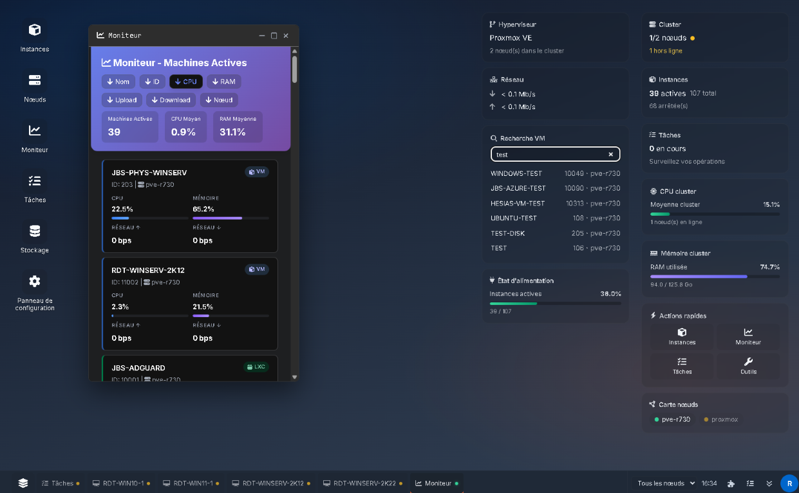
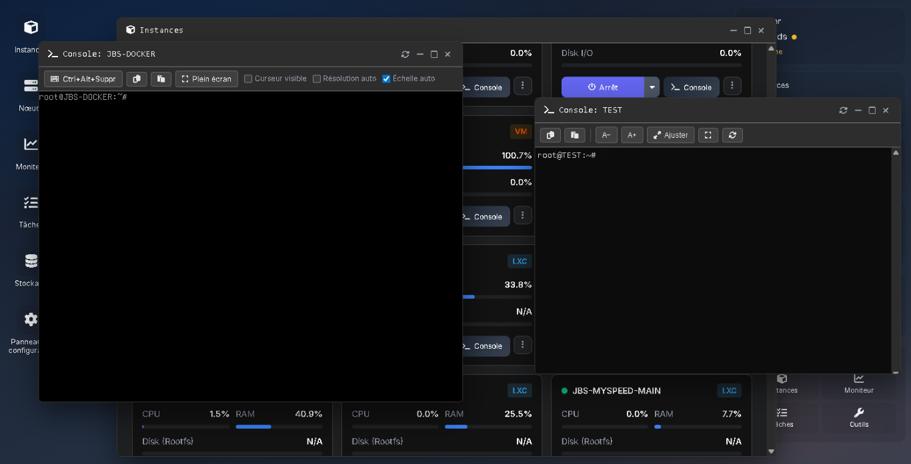
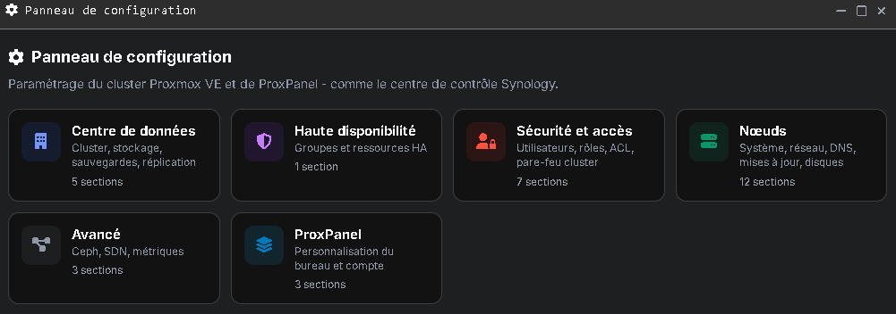

# ProxPanel

[](README.md) [](README.en.md) [](LICENSE) [](https://github.com/sannier3/ProxPanel/actions/workflows/docker-publish.yml)

> **Alpha version** — a lot of work remains. The UI and API are evolving with no stability guarantee. **Do not use on a critical production cluster** without a test environment, backups, and a Proxmox account with limited privileges.

**ProxPanel** is an alternative dashboard for [Proxmox VE](https://www.proxmox.com/): a web desktop-style interface, Proxmox API integration, and VM/LXC plus cluster tools in a simpler experience than the native UI.

- Repository: **[github.com/sannier3/ProxPanel](https://github.com/sannier3/ProxPanel)**
- Docker image: `ghcr.io/sannier3/proxpanel` (tags **`alpha`** and **`latest`**)

---

## Warnings

**⚠️ ProxPanel is not a finished product.** The repository is moving quickly: many areas are work-in-progress, only partly wired, or prone to regressions.

| Risk | Detail |
|------|--------|
| **Visible ≠ working** | Buttons, windows, or control-panel entries may appear in the UI without being fully implemented, reliable, or tested on your Proxmox version. |
| **Unpredictable behavior** | Silent failures, half-completed actions, or a UI that does not match the real cluster state. |
| **Impact on your infrastructure** | In production mode (`PROD=true`), the app calls the **Proxmox API** with the logged-in account’s rights: start/stop VMs, tasks, and depending on screens **cluster or node setting changes** — with a real risk of **breaking or degrading** your configuration if used carelessly. |
| **Local modules (`LOCAL_EXEC`)** | On a PVE-node install, scripts under `modules/` may affect the host. Only enable if you fully understand those scripts. |
| **Data and sessions** | Desktop persistence (`data/workspaces`) and session cookies are still being refined in alpha. |

**Recommendations:**

- Test first on a **lab cluster or node**, with up-to-date **snapshots / backups**.
- Use a **dedicated Proxmox account** with **minimal ACLs** (avoid exploring with `root@pam` if you can).
- Keep the **native Proxmox UI** for sensitive operations until you trust ProxPanel’s behavior.
- Report bugs via [Issues](https://github.com/sannier3/ProxPanel/issues) rather than assuming a problem is only on your side.

---

## Overview







---

## Features (alpha)

*The table below describes the **project goals**, not how complete each screen is. In alpha, a row may map to a partial or in-progress feature.*

| Area | Description |
|------|-------------|
| **Desktop** | Widgets, wallpaper, persisted workspace |
| **Instances** | VM/LXC grid, filters, actions, notes |
| **Nodes** | Cluster metrics, hypervisor shell (node terminal) |
| **Monitor** | Real-time stats for running guests |
| **Tasks** | List, detail window, stop running tasks |
| **Storage** | Datastores |
| **Control panel** | Edit cluster / node settings |
| **Consoles** | VNC (VM), terminal (LXC), shell (PVE node) |
| **Real-time** | SSE inventory + VM stats |

---

## Requirements

- **Node.js** ≥ 20 (native install), or **Docker**
- **Proxmox VE** cluster with HTTPS API (`PROD=true`)
- Demo mode without a cluster: `PROD=false`

---

## Quick start (Node.js)

```bash
git clone https://github.com/sannier3/ProxPanel.git
cd ProxPanel
cp .env.example .env
# Edit .env

npm install
npm start
```

→ [http://localhost:8080](http://localhost:8080)

```bash
npm run dev   # auto-reload
```

---

## Docker Compose

### Published image (GHCR)

| Tag | Description |
|-----|-------------|
| **`alpha`** | Automatic build from `main` (recommended for testing) |
| **`latest`** | Same as `alpha` for now; stable tag on releases later |
| **`2.0.0`** | Published on Git tag `v2.0.0` |

```bash
cp .env.example .env
# PROXMOX_URL, SESSION_SECRET, PROD=true, etc.

docker compose -f docker-compose.pull.yml up -d

PROXPANEL_IMAGE_TAG=latest docker compose -f docker-compose.pull.yml up -d
```

### Local build

```bash
docker compose up -d --build
```

Bind mounts: `./modules` (scripts), `./data/workspaces` (user desktops persisted on the host).

Details: [`deploy/README.md`](deploy/README.md).

---

## CI / Docker publishing

Workflow [`.github/workflows/docker-publish.yml`](.github/workflows/docker-publish.yml): push to `main` → `:alpha` and `:latest`; `v*` tag → semver.

First time: make the GHCR package public (*Packages* → *proxpanel* → *Package settings*).

---

## Configuration

Use **`.env`** ([`.env.example`](.env.example)). Priority: `.env` > `config.json` > defaults.

| Variable | Description |
|----------|-------------|
| `PROD` | `true` = real Proxmox API |
| `PROXMOX_URL` | PVE URL (e.g. `https://192.168.1.10:8006`) |
| `SESSION_SECRET` | Session secret (production) |
| `COLLECTOR_*` / `VMSTATS_*` / `REALTIME_*` | Collection and real-time |
| `WORKSPACE_DIR` | Desktop persistence |
| `LOCAL_EXEC` | Bash modules on the PVE host |

---

## Architecture

```
public/             Static UI
src/                Node.js API (Express, SSE, console proxy)
docs/images/        Screenshots
deploy/             systemd + deployment guide
.github/workflows/  Docker publishing
```

---

## API (overview)

| Route | Description |
|-------|-------------|
| `GET /api/health` | Health + `version` / `channel` |
| `POST /api/auth/login` | Proxmox login |
| `GET/POST /api/data?action=…` | Cluster data |
| `GET /api/realtime/events` | SSE |

---

## systemd deployment (without Docker)

```bash
sudo cp deploy/proxpanel.service /etc/systemd/system/
sudo systemctl enable --now proxpanel
```

On the Proxmox node: `PROXMOX_URL=https://127.0.0.1:8006`.

---

## Security

- **Unofficial** third-party Proxmox tool — not supported by Proxmox GmbH; respect PVE ACLs.
- Actions in the UI can have **real effects** on the cluster (see [Warnings](#warnings)).
- HTTPS + `COOKIE_SECURE=true` in production.
- Do not commit `.env` or secrets.

---

## Project status

| | |
|--|--|
| **npm version** | `2.0.0-alpha` |
| **Docker image** | `:alpha`, `:latest` |
| **Stability** | Alpha — many features incomplete; use at your own risk on real infrastructure |
| **Maturity** | Active development — no compatibility promise or ETA for a stable release |

Feedback welcome via [Issues](https://github.com/sannier3/ProxPanel/issues).
